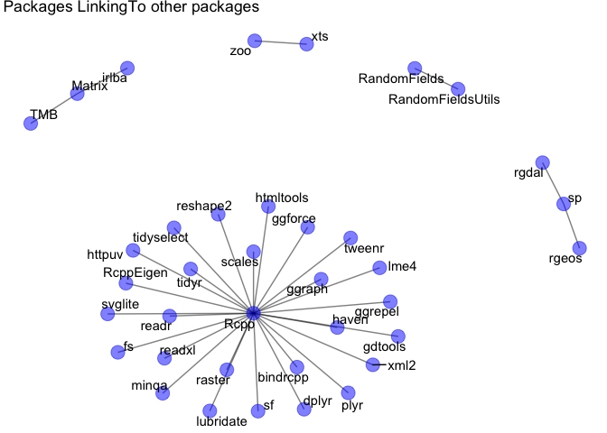

01\_explore-libraries\_jenny.R
================
elliotthazen
Wed Jan 31 15:09:04 2018

``` r
library(fs)
library(tidyverse)
```

    ## ── Attaching packages ──────────────────────────────────────────────────────────────────────────────────────────────────── tidyverse 1.2.1 ──

    ## ✔ ggplot2 2.2.1.9000     ✔ purrr   0.2.4     
    ## ✔ tibble  1.4.2          ✔ dplyr   0.7.4     
    ## ✔ tidyr   0.7.2          ✔ stringr 1.2.0     
    ## ✔ readr   1.1.1          ✔ forcats 0.2.0

    ## ── Conflicts ─────────────────────────────────────────────────────────────────────────────────────────────────────── tidyverse_conflicts() ──
    ## ✖ dplyr::filter() masks stats::filter()
    ## ✖ dplyr::lag()    masks stats::lag()

``` r
library(stringr)
library(igraph)
```

    ## 
    ## Attaching package: 'igraph'

    ## The following objects are masked from 'package:dplyr':
    ## 
    ##     as_data_frame, groups, union

    ## The following objects are masked from 'package:purrr':
    ## 
    ##     compose, simplify

    ## The following object is masked from 'package:tidyr':
    ## 
    ##     crossing

    ## The following object is masked from 'package:tibble':
    ## 
    ##     as_data_frame

    ## The following object is masked from 'package:fs':
    ## 
    ##     path

    ## The following objects are masked from 'package:stats':
    ## 
    ##     decompose, spectrum

    ## The following object is masked from 'package:base':
    ## 
    ##     union

``` r
library(ggraph)
library(here)
```

    ## here() starts at /Users/elliotthazen/Documents/R/github/explore-libraries

``` r
## how jenny might do this in a first exploration
## purposely leaving a few things to change later!
```

Which libraries does R search for packages?

``` r
.libPaths()
```

    ## [1] "/Library/Frameworks/R.framework/Versions/3.3/Resources/library"

``` r
## let's confirm the second element is, in fact, the default library
.Library
```

    ## [1] "/Library/Frameworks/R.framework/Resources/library"

``` r
path_real(.Library)
```

    ## /Library/Frameworks/R.framework/Versions/3.3/Resources/library

Installed packages

``` r
ipt <- installed.packages() %>%
  as_tibble()

## how many packages?
nrow(ipt)
```

    ## [1] 272

Exploring the packages

``` r
## count some things! inspiration
##   * tabulate by LibPath, Priority, or both
ipt %>%
  count(LibPath, Priority)
```

    ## # A tibble: 3 x 3
    ##   LibPath                                                 Priority       n
    ##   <chr>                                                   <chr>      <int>
    ## 1 /Library/Frameworks/R.framework/Versions/3.3/Resources… base          14
    ## 2 /Library/Frameworks/R.framework/Versions/3.3/Resources… recommend…    15
    ## 3 /Library/Frameworks/R.framework/Versions/3.3/Resources… <NA>         243

``` r
##   * what proportion need compilation?
ipt %>%
  count(NeedsCompilation) %>%
  mutate(prop = n / sum(n))
```

    ## # A tibble: 3 x 3
    ##   NeedsCompilation     n   prop
    ##   <chr>            <int>  <dbl>
    ## 1 no                 106 0.390 
    ## 2 yes                142 0.522 
    ## 3 <NA>                24 0.0882

``` r
##   * how break down re: version of R they were built on
ipt %>%
  count(Built) %>%
  mutate(prop = n / sum(n)) 
```

    ## # A tibble: 2 x 3
    ##   Built     n  prop
    ##   <chr> <int> <dbl>
    ## 1 3.3.0    63 0.232
    ## 2 3.3.2   209 0.768

Reflections

``` r
## reflect on ^^ and make a few notes to yourself; inspiration
##   * does the number of base + recommended packages make sense to you?
##   * how does the result of .libPaths() relate to the result of .Library?
```

Going further

``` r
## if you have time to do more ...

## is every package in .Library either base or recommended?
all_default_pkgs <- list.files(.Library)
all_br_pkgs <- ipt %>%
  filter(Priority %in% c("base", "recommended")) %>%
  pull(Package)
setdiff(all_default_pkgs, all_br_pkgs)
```

    ##   [1] "acepack"           "ade4"              "adehabitat"       
    ##   [4] "adehabitatHR"      "adehabitatHS"      "adehabitatLT"     
    ##   [7] "adehabitatMA"      "akima"             "animation"        
    ##  [10] "assertthat"        "backports"         "base64enc"        
    ##  [13] "BH"                "bindr"             "bindrcpp"         
    ##  [16] "bitops"            "broom"             "callr"            
    ##  [19] "caTools"           "CCA"               "cellranger"       
    ##  [22] "checkmate"         "CircStats"         "classInt"         
    ##  [25] "cli"               "clipr"             "clisymbols"       
    ##  [28] "coda"              "colorRamps"        "colorspace"       
    ##  [31] "corpcor"           "covr"              "crayon"           
    ##  [34] "crosstalk"         "curl"              "data.table"       
    ##  [37] "DBI"               "dbplyr"            "deldir"           
    ##  [40] "Deriv"             "desc"              "devtools"         
    ##  [43] "dichromat"         "digest"            "doParallel"       
    ##  [46] "dotCall64"         "dplyr"             "e1071"            
    ##  [49] "enc"               "evaluate"          "fda"              
    ##  [52] "FGN"               "fields"            "filehash"         
    ##  [55] "FNN"               "forcats"           "foreach"          
    ##  [58] "Formula"           "fs"                "gamm4"            
    ##  [61] "gbm"               "gdtools"           "geosphere"        
    ##  [64] "GGally"            "gganimate"         "ggforce"          
    ##  [67] "ggmap"             "ggplot2"           "ggplot2movies"    
    ##  [70] "ggraph"            "ggrepel"           "ggsn"             
    ##  [73] "gh"                "GISTools"          "git2r"            
    ##  [76] "glue"              "gmt"               "gridBase"         
    ##  [79] "gridExtra"         "gstat"             "gtable"           
    ##  [82] "gtools"            "haven"             "here"             
    ##  [85] "hexbin"            "highr"             "HKprocess"        
    ##  [88] "Hmisc"             "hms"               "hoardr"           
    ##  [91] "htmlTable"         "htmltools"         "htmlwidgets"      
    ##  [94] "httpuv"            "httr"              "igraph"           
    ##  [97] "ini"               "INLA"              "intervals"        
    ## [100] "irlba"             "iterators"         "jpeg"             
    ## [103] "jsonlite"          "knitr"             "labeling"         
    ## [106] "latticeExtra"      "lazyeval"          "leaflet"          
    ## [109] "lme4"              "ltsa"              "lubridate"        
    ## [112] "lunar"             "magrittr"          "mapdata"          
    ## [115] "mapproj"           "maps"              "maptools"         
    ## [118] "markdown"          "MatrixModels"      "mcmc"             
    ## [121] "MCMCpack"          "memoise"           "mime"             
    ## [124] "minqa"             "misc3d"            "mixtools"         
    ## [127] "mnormt"            "modelr"            "multcomp"         
    ## [130] "munsell"           "mvtnorm"           "ncdf4"            
    ## [133] "nloptr"            "NMF"               "numDeriv"         
    ## [136] "openssl"           "orthopolynom"      "PBSmapping"       
    ## [139] "pillar"            "pixmap"            "pkgconfig"        
    ## [142] "pkgmaker"          "plogr"             "plot3D"           
    ## [145] "plotdap"           "plyr"              "png"              
    ## [148] "polynom"           "praise"            "prettymapr"       
    ## [151] "prettyunits"       "progress"          "proj4"            
    ## [154] "proto"             "psych"             "purrr"            
    ## [157] "quantreg"          "R.methodsS3"       "R.oo"             
    ## [160] "R.utils"           "R6"                "RandomFields"     
    ## [163] "RandomFieldsUtils" "RANN"              "rappdirs"         
    ## [166] "raster"            "rasterVis"         "RColorBrewer"     
    ## [169] "Rcpp"              "RcppEigen"         "RCurl"            
    ## [172] "readr"             "readxl"            "registry"         
    ## [175] "rematch"           "rematch2"          "reprex"           
    ## [178] "rerddap"           "reshape"           "reshape2"         
    ## [181] "rex"               "rgdal"             "rgeos"            
    ## [184] "rgl"               "RgoogleMaps"       "rjson"            
    ## [187] "rlang"             "rmarkdown"         "rngtools"         
    ## [190] "rprojroot"         "rstudioapi"        "RUnit"            
    ## [193] "rvest"             "sandwich"          "scales"           
    ## [196] "SDMTools"          "segmented"         "selectr"          
    ## [199] "sf"                "shape"             "shapefiles"       
    ## [202] "shiny"             "sourcetools"       "sp"               
    ## [205] "spacetime"         "spam"              "SparseM"          
    ## [208] "SpatialDeltaGLMM"  "SpatialDFA"        "splancs"          
    ## [211] "stabledist"        "statmod"           "stringi"          
    ## [214] "stringr"           "styler"            "svglite"          
    ## [217] "testthat"          "TH.data"           "ThorsonUtilities" 
    ## [220] "tibble"            "tidyr"             "tidyselect"       
    ## [223] "tidyverse"         "tkrplot"           "TMB"              
    ## [226] "TMBhelper"         "translations"      "tweedie"          
    ## [229] "tweenr"            "udunits2"          "units"            
    ## [232] "usethis"           "utf8"              "VAST"             
    ## [235] "viridis"           "viridisLite"       "whisker"          
    ## [238] "withr"             "XML"               "xml2"             
    ## [241] "xtable"            "xts"               "yaml"             
    ## [244] "zoo"

``` r
## study package naming style (all lower case, contains '.', etc

## use `fields` argument to installed.packages() to get more info and use it!
ipt2 <- installed.packages(fields = "URL") %>%
  as_tibble()
ipt2 %>%
  mutate(github = grepl("github", URL)) %>%
  count(github) %>%
  mutate(prop = n / sum(n))
```

    ## # A tibble: 2 x 3
    ##   github     n  prop
    ##   <lgl>  <int> <dbl>
    ## 1 F        157 0.577
    ## 2 T        115 0.423

Try out some plotting created here: <https://github.com/aedobbyn/what-they-forgot/blob/5aced5a4061848bfb58ece7e3d8a742550145ab3/day1_s1_explore-libraries/package_links.R>

``` r
# Tibble of installed packages
inst_packages <- installed.packages() %>% as_tibble()

# Take a look at what we've got in LinkingTo; seems like a comma separated string
inst_packages$LinkingTo[1:50]
```

    ##  [1] NA            NA            NA            NA            NA           
    ##  [6] NA            NA            NA            NA            NA           
    ## [11] NA            NA            NA            NA            NA           
    ## [16] "Rcpp, plogr" NA            NA            NA            NA           
    ## [21] NA            NA            NA            NA            NA           
    ## [26] NA            NA            NA            NA            NA           
    ## [31] NA            NA            NA            NA            NA           
    ## [36] NA            NA            NA            NA            NA           
    ## [41] NA            NA            NA            NA            NA           
    ## [46] NA            NA            NA            NA            NA

``` r
# For now, take just the first link and remove trailing commas
inst_packages <- inst_packages %>%
  mutate(
    linking_to = str_split(LinkingTo, " ") %>% map_chr(first) %>% gsub(",", "", .)
  )

# Create the links between packages and their first LinkingTo package
package_links <- inst_packages %>%
  drop_na(linking_to) %>%
  select(Package, linking_to) %>%
  as_tibble() %>%
  igraph::graph_from_data_frame()

# Make the graph!
link_graph <- ggraph::ggraph(package_links, layout = "fr") +
  geom_edge_link(alpha = 0.5) +
  geom_node_point(color = "blue", size = 5, alpha = 0.5) +
  geom_node_text(aes(label = name), repel = TRUE) +
  theme_void() +
  ggtitle("Packages LinkingTo other packages")

link_graph
```



``` r
devtools::session_info()
```

    ## Warning in as.POSIXlt.POSIXct(Sys.time()): unknown timezone 'zone/tz/2017c.
    ## 1.0/zoneinfo/America/Los_Angeles'

    ## Session info -------------------------------------------------------------

    ##  setting  value                       
    ##  version  R version 3.3.2 (2016-10-31)
    ##  system   x86_64, darwin13.4.0        
    ##  ui       X11                         
    ##  language (EN)                        
    ##  collate  en_US.UTF-8                 
    ##  tz       <NA>                        
    ##  date     2018-01-31

    ## Packages -----------------------------------------------------------------

    ##  package     * version    date       source                         
    ##  assertthat    0.2.0      2017-04-11 CRAN (R 3.3.2)                 
    ##  backports     1.1.2      2017-12-13 CRAN (R 3.3.2)                 
    ##  base        * 3.3.2      2016-10-31 local                          
    ##  bindr         0.1        2016-11-13 CRAN (R 3.3.2)                 
    ##  bindrcpp    * 0.2        2017-06-17 CRAN (R 3.3.2)                 
    ##  broom         0.4.3      2017-11-20 CRAN (R 3.3.2)                 
    ##  cellranger    1.1.0      2016-07-27 CRAN (R 3.3.0)                 
    ##  cli           1.0.0      2017-11-05 CRAN (R 3.3.2)                 
    ##  colorspace    1.3-2      2016-12-14 CRAN (R 3.3.2)                 
    ##  crayon        1.3.4      2017-09-16 CRAN (R 3.3.2)                 
    ##  datasets    * 3.3.2      2016-10-31 local                          
    ##  devtools      1.13.4     2017-11-09 CRAN (R 3.3.2)                 
    ##  digest        0.6.14     2018-01-14 CRAN (R 3.3.2)                 
    ##  dplyr       * 0.7.4      2017-09-28 CRAN (R 3.3.2)                 
    ##  evaluate      0.10.1     2017-06-24 CRAN (R 3.3.2)                 
    ##  forcats     * 0.2.0      2017-01-23 CRAN (R 3.3.2)                 
    ##  foreign       0.8-69     2017-06-21 CRAN (R 3.3.2)                 
    ##  fs          * 1.1.0      2018-01-26 CRAN (R 3.3.2)                 
    ##  ggforce       0.1.1      2016-11-28 CRAN (R 3.3.2)                 
    ##  ggplot2     * 2.2.1.9000 2017-08-22 Github (hadley/ggplot2@41f154f)
    ##  ggraph      * 1.0.1      2018-01-29 CRAN (R 3.3.2)                 
    ##  ggrepel       0.7.0      2017-09-29 CRAN (R 3.3.2)                 
    ##  glue          1.2.0      2017-10-29 CRAN (R 3.3.2)                 
    ##  graphics    * 3.3.2      2016-10-31 local                          
    ##  grDevices   * 3.3.2      2016-10-31 local                          
    ##  grid          3.3.2      2016-10-31 local                          
    ##  gridExtra     2.3        2017-09-09 CRAN (R 3.3.2)                 
    ##  gtable        0.2.0      2016-02-26 CRAN (R 3.3.0)                 
    ##  haven         1.1.1      2018-01-18 CRAN (R 3.3.2)                 
    ##  here        * 0.1        2017-05-28 CRAN (R 3.3.2)                 
    ##  hms           0.4.1      2018-01-24 CRAN (R 3.3.2)                 
    ##  htmltools     0.3.6      2017-04-28 cran (@0.3.6)                  
    ##  httr          1.3.1      2017-08-20 cran (@1.3.1)                  
    ##  igraph      * 1.1.2      2017-07-21 CRAN (R 3.3.2)                 
    ##  jsonlite      1.5        2017-06-01 cran (@1.5)                    
    ##  knitr         1.18       2017-12-27 CRAN (R 3.3.2)                 
    ##  labeling      0.3        2014-08-23 CRAN (R 3.3.0)                 
    ##  lattice       0.20-35    2017-03-25 CRAN (R 3.3.2)                 
    ##  lazyeval      0.2.1      2017-10-29 CRAN (R 3.3.2)                 
    ##  lubridate     1.7.1      2017-11-03 CRAN (R 3.3.2)                 
    ##  magrittr      1.5        2014-11-22 CRAN (R 3.3.0)                 
    ##  MASS          7.3-48     2017-12-25 CRAN (R 3.3.2)                 
    ##  memoise       1.1.0      2017-04-21 CRAN (R 3.3.2)                 
    ##  methods     * 3.3.2      2016-10-31 local                          
    ##  mnormt        1.5-5      2016-10-15 CRAN (R 3.3.0)                 
    ##  modelr        0.1.1      2017-07-24 CRAN (R 3.3.2)                 
    ##  munsell       0.4.3      2016-02-13 CRAN (R 3.3.0)                 
    ##  nlme          3.1-131    2017-02-06 CRAN (R 3.3.2)                 
    ##  parallel      3.3.2      2016-10-31 local                          
    ##  pillar        1.1.0      2018-01-14 CRAN (R 3.3.2)                 
    ##  pkgconfig     2.0.1      2017-03-21 CRAN (R 3.3.2)                 
    ##  plyr          1.8.4      2016-06-08 CRAN (R 3.3.0)                 
    ##  psych         1.7.8      2017-09-09 CRAN (R 3.3.2)                 
    ##  purrr       * 0.2.4      2017-10-18 CRAN (R 3.3.2)                 
    ##  R6            2.2.2      2017-06-17 cran (@2.2.2)                  
    ##  Rcpp          0.12.15    2018-01-20 CRAN (R 3.3.2)                 
    ##  readr       * 1.1.1      2017-05-16 CRAN (R 3.3.2)                 
    ##  readxl        1.0.0      2017-04-18 CRAN (R 3.3.2)                 
    ##  reshape2      1.4.3      2017-12-11 CRAN (R 3.3.2)                 
    ##  rlang         0.1.6      2017-12-21 CRAN (R 3.3.2)                 
    ##  rmarkdown     1.8        2017-11-17 CRAN (R 3.3.2)                 
    ##  rprojroot     1.3-2      2018-01-03 CRAN (R 3.3.2)                 
    ##  rstudioapi    0.7        2017-09-07 CRAN (R 3.3.2)                 
    ##  rvest         0.3.2      2016-06-17 CRAN (R 3.3.0)                 
    ##  scales        0.5.0      2017-08-24 CRAN (R 3.3.2)                 
    ##  stats       * 3.3.2      2016-10-31 local                          
    ##  stringi       1.1.6      2017-11-17 CRAN (R 3.3.2)                 
    ##  stringr     * 1.2.0      2017-02-18 CRAN (R 3.3.2)                 
    ##  tibble      * 1.4.2      2018-01-22 CRAN (R 3.3.2)                 
    ##  tidyr       * 0.7.2      2017-10-16 CRAN (R 3.3.2)                 
    ##  tidyselect    0.2.3      2017-11-06 CRAN (R 3.3.2)                 
    ##  tidyverse   * 1.2.1      2017-11-14 CRAN (R 3.3.2)                 
    ##  tools         3.3.2      2016-10-31 local                          
    ##  tweenr        0.1.5      2016-10-10 CRAN (R 3.3.0)                 
    ##  udunits2      0.13       2016-11-17 cran (@0.13)                   
    ##  units         0.5-1      2018-01-08 CRAN (R 3.3.2)                 
    ##  utf8          1.1.3      2018-01-03 CRAN (R 3.3.2)                 
    ##  utils       * 3.3.2      2016-10-31 local                          
    ##  viridis       0.4.1      2018-01-08 CRAN (R 3.3.2)                 
    ##  viridisLite   0.2.0      2017-03-24 CRAN (R 3.3.2)                 
    ##  withr         2.1.1      2017-12-19 CRAN (R 3.3.2)                 
    ##  xml2          1.1.1      2017-01-24 CRAN (R 3.3.2)                 
    ##  yaml          2.1.16     2017-12-12 CRAN (R 3.3.2)
>>>>>>> d1ab9f0e3877f93bc3b63c27eb2e1be965d000a7
